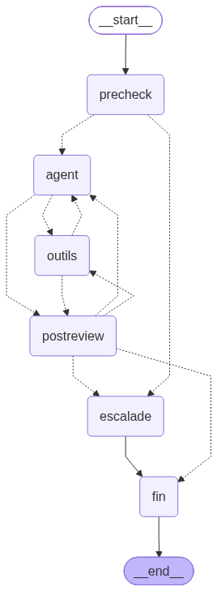

# Néova — customer-relations agent

## Embeddings: `qwen/qwen3-embedding-8b`

Chosen for French: multilingual by training (first on MTEB multilingual at release), and a query-side instruction bridges colloquial customer French and the formal wording of the documents; paired with French-stemmed BM25 for exact terms.
Measured recall on the 45-question French set is 0.97; a side-by-side comparison with another model (e.g. `mistralai/mistral-embed`) was not run.

## Run it

First run:

```bash
cp .env.example .env            # put the OpenRouter key and the model names there
uv sync
uv run python -m neova.rag.index --build   # parses and embeds the corpus (a few cents)
```

Then:

```bash
uv run neova chat               # starts the API in the background and opens the conversation
```

Evaluation and tests:

```bash
uv run python -m neova.rag.eval_retrieval            # retrieval + answer step on eval/retrieval_gold.jsonl
uv run python -m neova.rag.eval_retrieval --no-llm   # retrieval only, no chat model call
uv run pytest -q                                     # offline tests, scripted model
```


Scenarios to check that it works, one new chat each:

| Messages | Expected |
|---|---|
| `Combien coûte la fibre 1 Gb/s ?` | 39,99 € / mois, from the 2026 grid |
| `La fibre 1 Gb/s est-elle toujours en promo ?` | No: the 2026 grid replaces the 2024 promo, current price 39,99 € (contradictory documents) |
| `Quels étaient les prix de la promo de rentrée 2024 ?` | The 2024 prices, presented as a past offer |
| `Je vais saisir mon avocat.` | Immediate transfer, no question asked |
| `Patrick Doré`, then `Combien je dois ?` | 39,99 €, read from his record |
| `Je veux un technicien` → the agent asks for the reason → `Plus d'internet, voyant rouge fixe après deux redémarrages` → `Patrick Doré` → `oui` | A slot with its fees is proposed; booked only after `oui` |
| `Ahmed Belkacem`, then `Je peux payer en plusieurs fois ?` | Transfer (payment plan) |

To change customer during a chat, just type the other customer's full name: the conversation
starts again, and nothing of the previous customer is kept.

`challenges.md` lists one or two checks for every requirement of the brief.

Models (set in `.env`): chat `google/gemini-2.5-flash` with fallback
`mistralai/mistral-small-3.2-24b-instruct`, embeddings `qwen/qwen3-embedding-8b`, vision
`google/gemini-2.5-flash` for the scanned sheet. The clock is frozen on the dataset's date
(`REFERENCE_NOW`).

## The graph

```
precheck ──match──▶ handoff ──▶ END
   │
   ▼
 agent ⇄ tools ──request_handoff──▶ handoff
   │        └────booking confirmed──▶ END
   │
   ▼
post_review ──human──▶ handoff        otherwise ──▶ END
```



One run per customer message; `MemorySaver` keeps the conversation (messages, session, pending
proposal, ticket) between messages. Conversations do not survive a restart.

- **precheck**: an LLM checks the "transfert immédiat" section of the escalation procedure,
  verbatim. A match goes straight to **handoff**, before any identification.
- **agent ⇄ tools** (ReAct): one LLM with `bind_tools` picks its tools: `search_documents`,
  `verify_customer`, `get_customer`, `get_incidents`, `propose_appointment`, `book_appointment`,
  `assess_gesture`, `request_handoff`. Reads are free; the writes are gated by code:
  `propose_appointment` picks the slot itself, `book_appointment` runs only if a proposal is
  pending and a structured check reads the customer's message as a clear yes, a 500 during the
  write is replayed with the same idempotency key on the next message, and once the booking API
  succeeds the customer gets a confirmation that restates the slot and fees of the accepted
  proposal.
- **post_review**: an LLM checks the replies the agent writes against the "transfert après
  examen" section before the customer reads them; booking confirmations and transfer messages
  come from their own paths. It may ask once for a missing document or customer fact, which code
  fetches; it transfers only if the documents cannot settle the case.
- **handoff**: the ticket is drafted, created with an idempotency key, then the delay the API
  returned is announced. Each transfer creates one ticket; retrying a transfer whose result is
  uncertain reuses the same idempotency key, so it never creates a duplicate. A failed creation
  is never announced.

The decision to hand over is made by an LLM: `precheck` before the work, the agent during it,
`post_review` after it. Tools return facts ("the contract is professional", "verification
refused a second time") and the agent decides. Code hands over in three cases where no LLM
verdict can be trusted: the model is down after retries, the loop passes its step cap, or a
check returns an invalid verdict (an item number outside the procedure, or evidence not found in
the customer's words).

## Evaluation

A hand-written set in `eval/`, run with the real models: 45 questions written from the PDFs, 37
with an answer in the corpus, 8 close to the topics but without one
(`uv run python -m neova.rag.eval_retrieval`).

**Retrieval** (the `search_documents` path the agent uses):

| Measure | Result |
|---|---|
| Full-evidence recall: every section the answer needs is in the context | **0.97** (36/37) |
| MRR of the first expected section | 0.84 |
| Archive (deprecated) sections returned without a reason | **0** |
| FAQ questions asked in other words than the document, section found | 10/10 |

**Answer step** (offline, `rag/answer.py`, not the agent's path). The graph writes its own
replies; these rows measure what the retrieved context supports through a reference answer step,
not the agent.

| Measure | Result |
|---|---|
| Table questions, correct value in the answer | 14/15 (the miss is the retrieval miss above) |
| "Not in corpus" on the 8 unanswerable questions | **8/8** |
| Answerable questions refused | 4/37: one retrieval miss, one needing contract data, one caution on promo vs. grid price, one real error (Pro offers) |

Best cosine similarity alone cannot separate the two groups: a threshold above every
unanswerable question (0.703) would also reject 11 answerable ones. Adding an LLM-written
sentence version of each table to the index raised recall from 0.94 to 0.97; a second prompt
asking for customer-style descriptions did worse (0.95) and was reverted.

Spend so far: about $2.92 of the $10, coding assistant included.

## Three design decisions

**1. The LLM chooses its tools; the code owns the writes.** *Revised.* The first version had a
planner node deciding route, identification and clarification before any lookup. That was right
about writes and wrong about reads: manual testing produced requests the planner could not
classify without information it did not have yet (a greeting, "quels sont les autres créneaux",
identifiers typed unasked), and each fix added a node. The rewrite keeps the guarantees in code
around the writes (explicit yes, stored proposal, idempotency key, replay) and lets the agent
call the read tools freely. *Traded away:* determinism of the path. The checks aim to limit
unsupported answers and unconfirmed actions; how reliable they are end to end is still to be
measured.

**2. Internal documents are prompt context for decision nodes, never retrieval material.**
The two internal PDFs (escalation procedure, commercial-gesture policy) are excluded from the
index by their own `audience: internal` header. `agent/build_prompts.py` copies their sections
verbatim into five static templates, one per decision node; each node's output is a closed
schema (situation numbers, condition statuses). The agent never sees these rules, only the
decision nodes do. *Traded away:* the model applies numeric rules ("48 h", "6 mois") itself.
Code overrides what the data settles (an unavailable gesture history can never yield
"eligible", a positive balance can never be "no unpaid balance").

**3. Contradictions are resolved by document status before search, not by the model.**
Each chunk carries metadata read from its own document: status, dates, offer window. The only
contradiction in the corpus (the 2024 promo prices vs. the 2026 grid) is handled by filtering
`deprecated` chunks out of every search; the archive is searched only for an explicit historical
question or a customer whose contract started inside the offer window, and is then shown with an
ARCHIVE banner. *Traded away:* a future obsolete document without a status header would not be
filtered.

## What's broken or unfinished

- The agent has no automated end-to-end evaluation: only retrieval is measured, and the graph is
  covered by offline tests with a scripted model.
- A customer record is inconsistent (balance 39,99 € vs. an unpaid invoice of 52,49 €); the agent
  answers from one of the two without flagging it.
- A request the documents reserve to an advisor (e.g. a payment plan above the threshold) is
  transferred without first restating the documented rule to the customer.
- The FAQ says technicians work Tuesday to Saturday; the API offers a Monday slot. The API is
  treated as the system of record.
- Deciding that the corpus has no answer is left to an LLM. A similarity threshold was tried and
  rejected (see Evaluation); an NLI check was considered but set aside for other features. The
  LLM is not deterministic, so the same question can be answered once and transferred the next
  time, and a vague question can be answered by inference from a document that does not really
  cover it.
- The agent can propose a technician when the visit is not justified. Ahmed reports a slow
  connection; the agent proposes a slot at once, although his area has a degraded-network
  incident and the box FAQ reserves a visit for a slow line "malgré un réseau déclaré nominal".
  The API only blocks a full outage. In one run `post_review` fetched the incidents itself and
  reasoned correctly, but only a check on the reply's claims (since removed) turned that into a
  transfer, and for the wrong reason. Whether a visit is justified rests on the agent's prompt alone.

## With two more days

1. A clear plan for when a customer is entitled to a technician: check the area's incidents and
   the FAQ's intervention cases before any proposal, and only then let the customer book.
2. Rework conversation memory so each question is judged on its own: the checks read the recent
   transcript, so an earlier request can still weigh on how a later, unrelated one is treated.
3. Improve `post_review`: measure its false transfers and misses on a labelled set, then tighten it.
4. An end-to-end evaluation of the agent: scripted conversations checked on the API's records
   and on what the customer reads, with cases written by someone other than the author.
5. Persist conversations (`SqliteSaver`) and expire API sessions.
6. Langfuse tracing per node, with the evaluations wired in.
7. Detect inconsistent customer records and hand them off instead of answering from one figure.
